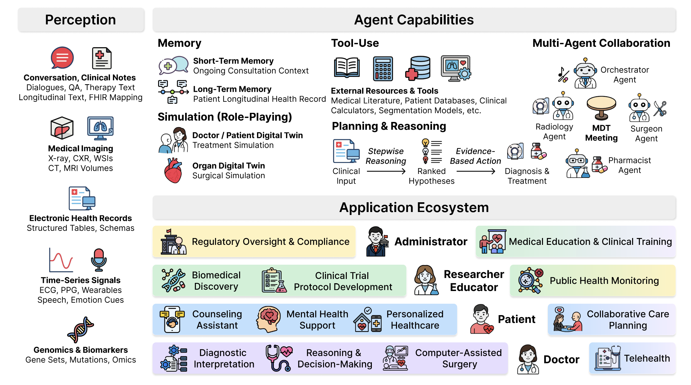

#### A Comprehensive Survey of Agentic AI in Healthcare

#### Note:
This paper presents a comprehensive survey of Agentic AI in the healthcare industry. The main focus is on how large language model (LLM)–based agents can be applied within healthcare domains. It discusses various applications of agentic AI, along with their advantages, disadvantages and challenges.

#### Application using Multiagent LLM for healthcare
* Natural language & dialogue: Agents handle conversations, Q&A, and therapy text.

* Electronic health records & clinical notes: Agents extract insights, summarize, and map structured data.

* Medical imaging: Agents analyze 2D (X-rays, slides) and 3D images (CT, MRI) for diagnosis.

* Time-series signals: Agents interpret ECG, PPG, and wearable data for monitoring.

* Genomics & biomarkers: Agents study gene sets, mutations, and omics data for personalized medicine.

* Audio & speech: Agents detect emotion, speech cues, and assist in therapy.

* Multi-modal integration: Agents combine text, images, signals, and omics to make comprehensive decisions.

#### Challenges
1. Safety & Reliability: Risk of errors in diagnosis or treatment if agents act incorrectly.

2. Data Quality & Bias: Poor or biased training data can lead to unfair or inaccurate outcomes.

3. Integration with Clinical Workflows: Difficult to fit agents seamlessly into hospitals or clinics.

4. Human Oversight & Trust: Clinicians need to verify agent decisions, limiting full autonomy.

5. Privacy & Security: Handling sensitive patient data safely is critical.

5. Explainability: Complex agent reasoning can be hard for humans to understand.

6. Multi-modal Coordination: Combining text, images, signals, and genomics data accurately is challenging.

7. Regulation & Compliance: Agents must follow strict healthcare laws and guidelines.

6. Scalability: Deploying across different hospitals or patient populations can be hard.

