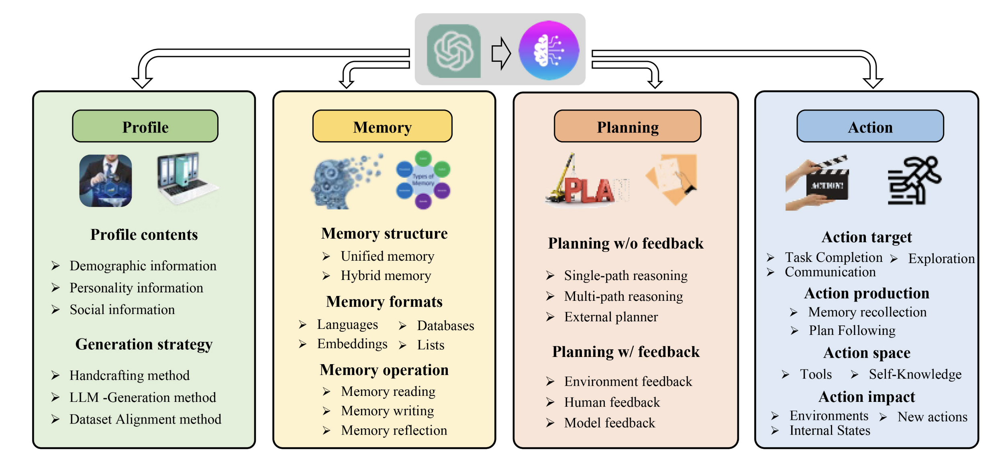
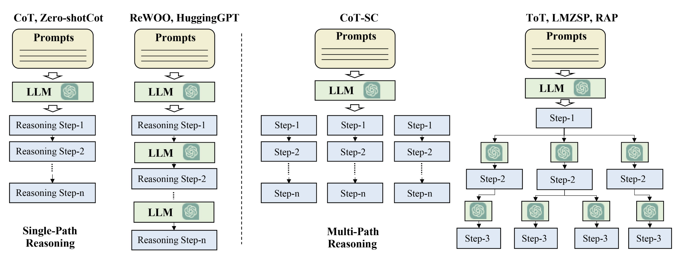

#### A Survey on Large Language Model based Autonomous Agents

#### Summary
This paper reviews research on autonomous agents that are built using large language models (LLMs) like GPT-style models that can act on their own in different settings by thinking, planning, remembering, and taking actions. It organizes many studies to help researchers understand the field as a whole.

#### How These Agents Are Built

The paper introduces a unified framework that many existing agent systems use. It generally includes:

1. Profile Module
* Sets the role and personality of the agent (like “assistant,” “planner,” etc.).
* Helps guide how the agent should behave.

2. Memory Module
* Stores past events, facts, or knowledge so the agent can remember things over time.
* Often organized with short-term and long-term memory.

3. Planning Module
* Helps break tasks into steps and think ahead.
* Supports both simple and complex reasoning.

4. Action Module
* Turns the agent’s plan into actions, often by executing tools, commands, or steps

#### Where These Agents Are Used
LLM-based agents are being applied across many areas:

1. Social Science: Simulating humans, studying social behavior.

2. Natural Science: Assisting research tasks, planning experiments.

3. Engineering: Automated coding, robotics, and decision systems.

#### How We Evaluate These Agents
1. Simulation Tests: Letting agents interact with environments and measuring task success.

2. Social Evaluation: Testing how well agents mimic human interactions.

3. Multi-Task Evaluation: Checking general ability across many types of tasks.