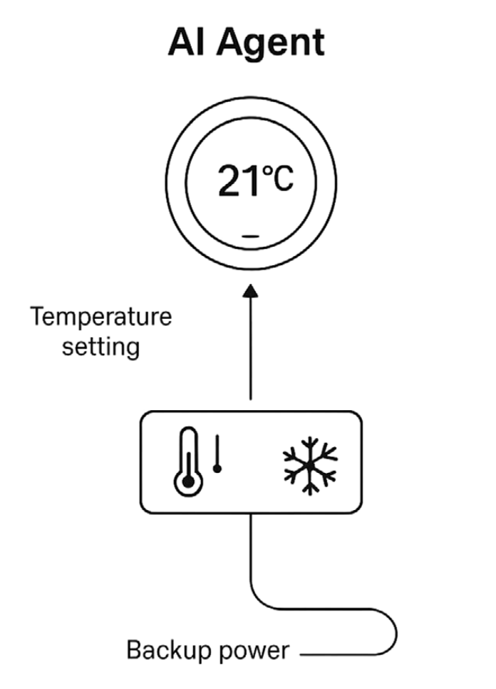
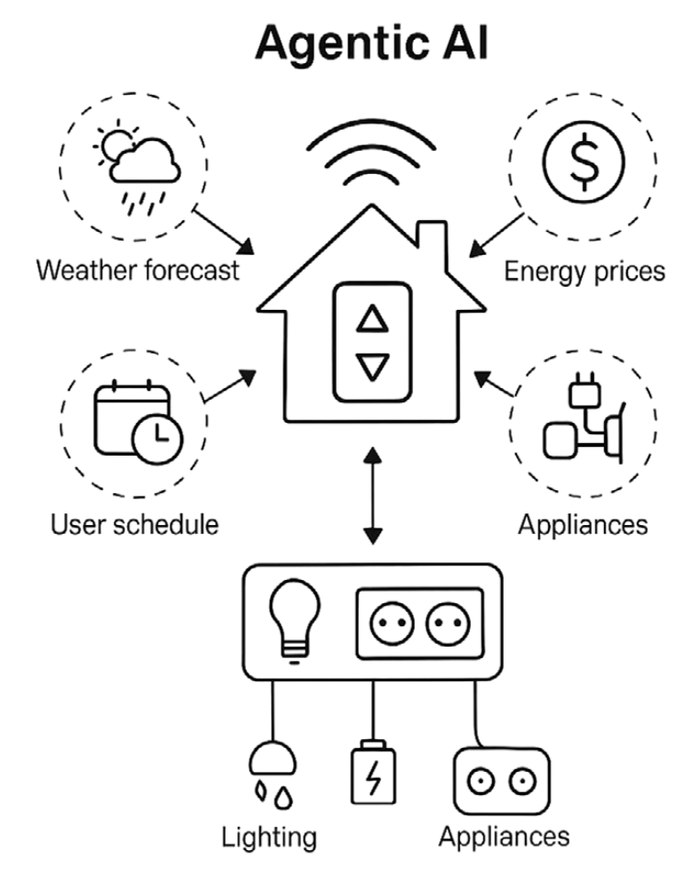
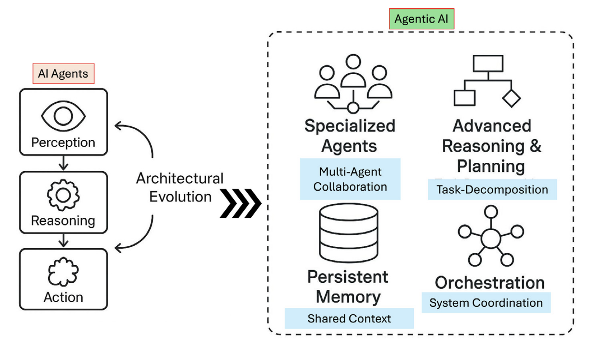
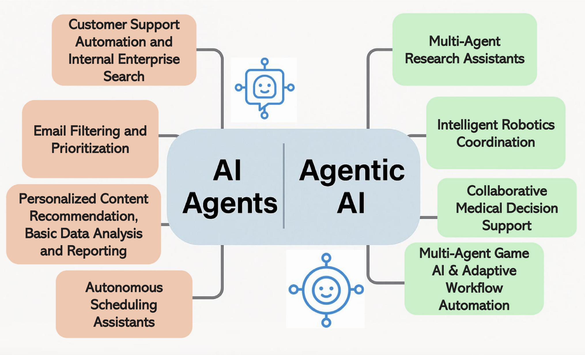
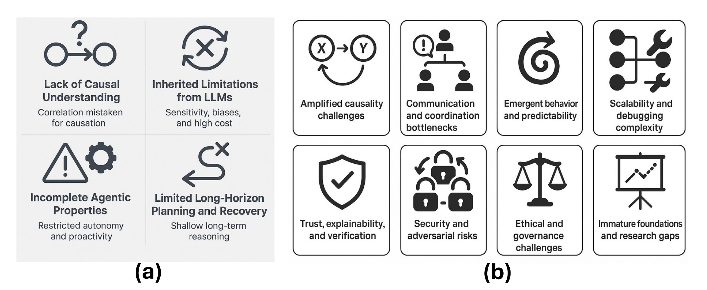

#### AI Agents vs. Agentic AI: A Conceptual taxonomy, applications and challenges

#### Paper Summary
This paper describes the conceptual difference between AI Agents from Agentic AI, explains how they differ in design, capabilities, autonomy, and maps their applications and core challenges in modern AI systems. It also outlines solutions and a roadmap for developing robust, scalable, and explainable AI-driven systems.

#### AI agents Vs Agentic AI
AI Agents
1. Definition: AI agents are autonomous software programs designed to perform a specific task.
2. Autonomy: They work independently but only within a limited task scope.
3. Task Complexity: They usually handle one focused task at a time.
4. Collaboration: They operate alone and do not coordinate with other agents.
5. Learning & Adaptation: They can learn and improve, but only within their assigned domain.
6. Applications: They are commonly used in chatbots, virtual assistants, and automated workflows.

Agentic AI
1. Definition: Agentic AI is a system where multiple AI agents work together to achieve complex goals.
2. Autonomy: It has a broader level of autonomy and can manage multi-step processes.
3. Task Complexity: It handles complex tasks that require planning and coordination.
4. Collaboration: Multiple agents share information and cooperate to complete tasks.
5. Learning & Adaptation: It learns and adapts across different tasks and changing environments.
6. Applications: It is used in supply chain management, business optimization, and virtual project management.

#### Architectural Comparison

AI Agent: Prompt → Tool Call→ LLM → Output
Agentic AI: Prompt → LLM +Memory/Planning→ Output

#### Application of AI Agent Vs Agentic AI

#### Challenges of AI Agent Vs Agentic AI

