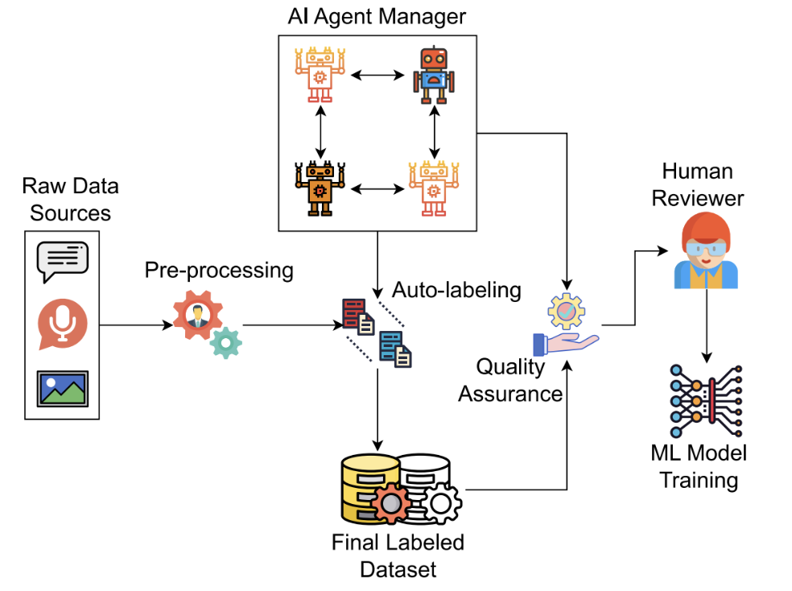

#### Transforming Data Annotation with AI Agents: A Review of Architectures, Reasoning, Applications, and Impact

#### Summary
LLM-powered AI agents are transforming data annotation by automating and improving tasks that traditionally struggled with scale, consistency, cost, and domain expertise. 

#### Data Annotation is Critical but Hard

* To train AI models, massive amounts of labeled data are needed like images tagged with objects, or text labeled with sentiment or meaning.

* Traditional annotation (humans manually labeling data) is expensive, slow, inconsistent, and doesn’t scale for huge datasets.

#### How this helps?
AI systems only work well if the labels are high-quality. If labels are wrong or inconsistent, models learn incorrect patterns and fixed it in next time.

* Automating Labeling: Instead of humans tagging every example, agents can generate labels automatically for text, images, audio, etc.

* Active and Smart Data Selection: Rather than labeling everything, agents choose the most informative examples first, saving effort and improving model learning.

* Quality Checking: Agents can review labels, find errors or inconsistencies, and fix them — sometimes better than humans alone.

* Adaptive Guidelines: When rules are unclear, agents can clarify or adapt the guidelines so annotations are more consistent.

* Human in the Loop (HITL): Agents handle routine or easy parts while humans manage hard edge cases or approve complex decisions combining speed with reliability

#### Benefits of AI Agent-Driven Annotation

* Speed: Agents can label thousands or millions of examples much faster than humans.

* Cost Reductions: Annotation costs drop significantly because fewer humans are needed.

* Consistency: AI agents tend to be more uniform in labeling decisions than groups of human annotators.

* Better Integration: Agents can integrate sophisticated reasoning (like chain of thought) into labeling decisions.

#### Problem still need to solve
*  Hallucinations & Errors: AI agents can still make mistakes, especially on ambiguous or specialized data.

* Bias and Fairness: Agents may reproduce or amplify biases in the data if not carefully controlled.

* Transparency: Understanding why the agent labeled something a certain way can be hard.

* Data Privacy: Sending sensitive data to cloud-based language models poses privacy risks

