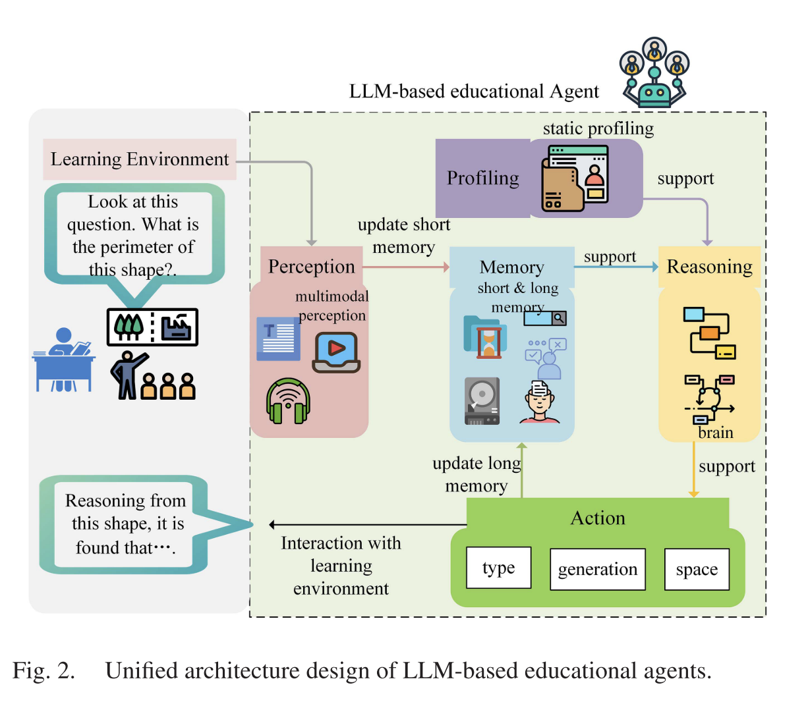
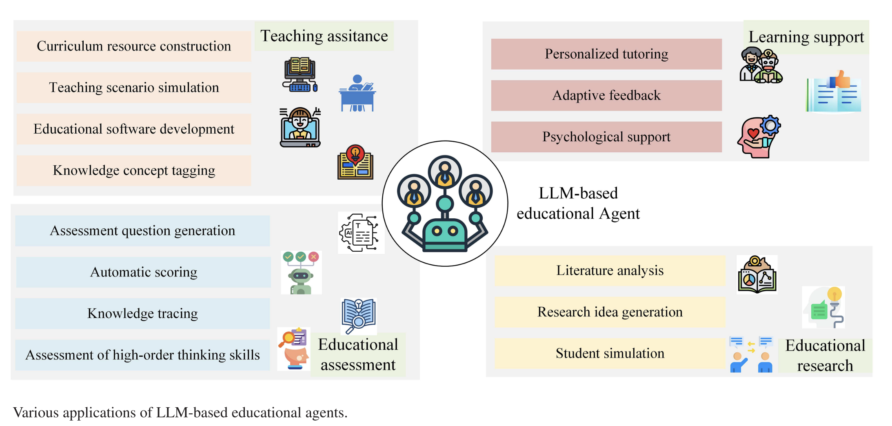

#### A Comprehensive Survey on Large-Language-Model-Based Agents for Education

This paper is a comprehensive, system-level survey of LLM-based educational agents, proposing a unified agent architecture, reviewing capability acquisition methods, mapping applications across the full education pipeline, and identifying evaluation practices and open challenges

#### Core conceptual contribution: a unified architecture

The paper’s most important intellectual contribution is the five-module architecture for LLM-based educational agents:

The five modules

* Perception – understanding inputs (text, speech, multimodal signals)

* Profiling – defining the agent’s role, persona, expertise, and behavior

* Memory – storing and retrieving experiences and knowledge

* Reasoning – decision-making, planning, and adaptation

* Action – interacting with learners and environments

#### How agents acquire educational capabilities

The paper identifies two dominant mechanisms:

### Fine-tuning

Adapts LLMs to educational tasks using domain-specific data

### Strengths

* Improves task accuracy

* Enables specialized roles

### Limitations

* Costly

* Risk of catastrophic forgetting

* Hard to maintain general abilities

### Prompt engineering

Uses structured prompts to guide behavior without retraining

### Strengths

* Low cost

* Highly flexible

* Supports rapid prototyping

### Limitations

* Fragile

* Hard to generalize

* Sensitive to prompt design

#### Application 

#### Model Evaluation
Subjective evaluation 

* Human ratings

* Questionnaires

* Expert review

### Objective evaluation

* Metrics include:

* Task success

* Human similarity

* Efficiency

### Challenges
* Data privacy & bias

* Hallucination

* Overreliance

* Benchmark scarcity
