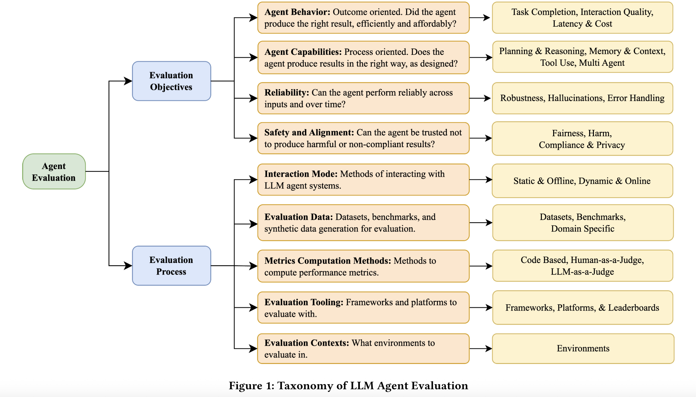

#### Evaluation and Benchmarking of LLM Agents: A Survey

This paper surveys how LLM-based agents are evaluated, showing that current evaluation methods are fragmented, incomplete, and poorly suited for real-world and enterprise deployment

#### What Makes Evaluating LLM Agents Hard?

The paper identifies several fundamental challenges:

1. Agents are interactive and dynamic
* Behavior unfolds over multiple steps and depends on environment feedback

2. Agents are probabilistic
* Same task → different outcomes across runs
* Traditional deterministic testing fails

3. Agents combine multiple capabilities
* Reasoning, planning, tool use, memory, collaboration
* Evaluating only final output hides internal failures

4. Real-world constraints are ignored
* Role-based access control
* Compliance policies
* Long-running tasks
* Cost and latency trade-offs

#### LLM Agent Evaluation 

#### Key Gaps Identified

1. Overreliance on task success

* Agents can succeed once but fail repeatedly (lack of reliability)

2. Weak robustness testing

* Limited stress testing for input perturbations, tool failures, or environment changes

* Poor long-horizon evaluation

* Most benchmarks ignore multi-day or multi-session agent behavior

3. Safety and compliance are under-tested

* Especially for adversarial inputs and enterprise policies

4. Enterprise needs are overlooked

* Role-based access control

* Auditing and explainability

* Regulatory compliance
